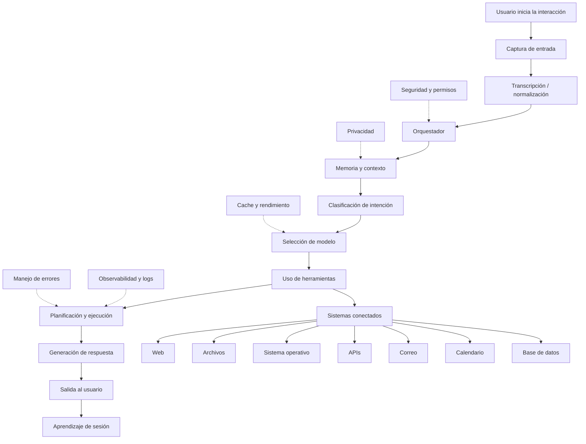

# Flujo habitual de un asistente AI local-first

Este documento explica el flujo completo de funcionamiento de un asistente AI moderno, similar a OpenClaw, Kara u otros asistentes locales/orquestadores de agentes.

El objetivo es entender qué ocurre desde que el usuario habla, escribe o ejecuta un atajo, hasta que el sistema responde, usa herramientas, ejecuta acciones y guarda contexto para futuras interacciones.

---

## Visión general

Un asistente AI no es solo un modelo LLM respondiendo texto. En una arquitectura seria, el LLM es una pieza dentro de un sistema mayor compuesto por:

- Entrada de usuario: voz, texto, archivos, pantalla o eventos.
- Normalización y transcripción.
- Orquestador central.
- Memoria y contexto.
- Clasificación de intención.
- Selección dinámica de modelo.
- Herramientas conectadas.
- Planificador de acciones.
- Motor de ejecución.
- Generador de respuesta.
- Seguridad, permisos, logs y control de errores.

Flujo simplificado:

```txt
Usuario
  ↓
Entrada
  ↓
Normalización
  ↓
Orquestador
  ↓
Contexto + intención
  ↓
Modelo + herramientas
  ↓
Planificación / ejecución
  ↓
Respuesta
  ↓
Memoria de sesión
```

---

## Diagrama conceptual



---

# 1. Usuario inicia la interacción

El flujo empieza cuando el usuario interactúa con el asistente.

La entrada puede venir de diferentes canales:

- Texto escrito en un chat.
- Voz mediante micrófono.
- Atajo de teclado global.
- Comando desde una app de escritorio.
- Evento del sistema.
- Archivo arrastrado a la interfaz.
- Captura de pantalla o contexto visual.
- Mensaje desde WhatsApp, Telegram, Slack o WebChat.

Ejemplo:

```txt
"Resume este documento y crea una tarea para revisarlo mañana."
```

En este punto todavía no hay inteligencia aplicada. Solo existe una intención humana expresada mediante algún canal.

---

# 2. Captura de entrada

La capa de captura convierte la interacción del usuario en un formato interno que el sistema pueda procesar.

Ejemplos de entrada:

```json
{
  "type": "text",
  "content": "Busca el último informe y resume los puntos clave",
  "source": "desktop_chat",
  "sessionId": "session_123"
}
```

Para voz:

```json
{
  "type": "audio",
  "filePath": "./tmp/input.wav",
  "source": "microphone",
  "sessionId": "session_123"
}
```

Para archivo:

```json
{
  "type": "file",
  "filePath": "./uploads/report.pdf",
  "mimeType": "application/pdf",
  "sessionId": "session_123"
}
```

Esta capa debe ser simple, robusta y segura. Su responsabilidad principal es capturar datos y pasarlos al pipeline.

---

# 3. Transcripción y normalización

Si la entrada es voz, primero se convierte a texto usando un modelo STT, por ejemplo Whisper o un modelo local compatible.

Entrada:

```txt
Audio del usuario
```

Salida:

```txt
"Busca los últimos documentos del proyecto Kara y prepara un resumen."
```

Después se normaliza la entrada:

- Limpieza de espacios.
- Corrección básica de formato.
- Detección de idioma.
- Extracción de archivos adjuntos.
- Conversión de formatos.
- Preparación del texto para el orquestador.

Ejemplo de objeto normalizado:

```json
{
  "inputType": "text",
  "language": "es",
  "text": "Busca los últimos documentos del proyecto Kara y prepara un resumen.",
  "attachments": [],
  "sessionId": "session_123"
}
```

---

# 4. Orquestador

El orquestador es el cerebro operativo del sistema. No necesariamente es el LLM. Es la capa que decide qué flujo debe ejecutarse.

Responsabilidades principales:

- Recibir la petición normalizada.
- Consultar memoria y contexto.
- Clasificar la intención.
- Decidir si necesita herramientas.
- Elegir modelo.
- Ejecutar pasos.
- Controlar permisos.
- Gestionar errores.
- Emitir respuesta final.

Ejemplo conceptual en Go:

```go
package application

import "context"

type Orchestrator struct {
	intentClassifier IntentClassifier
	modelSelector    ModelSelector
	toolRegistry     ToolRegistry
	llmProvider      LLMProvider
	memory           MemoryRepository
}

func (o *Orchestrator) Handle(ctx context.Context, input UserInput) (*AssistantOutput, error) {
	contextData, err := o.memory.LoadContext(ctx, input.SessionID)
	if err != nil {
		return nil, err
	}

	intent, err := o.intentClassifier.Classify(ctx, input.Text, contextData)
	if err != nil {
		return nil, err
	}

	model, err := o.modelSelector.Select(intent)
	if err != nil {
		return nil, err
	}

	result, err := o.llmProvider.Chat(ctx, model.Name, input.Text, contextData)
	if err != nil {
		return nil, err
	}

	return &AssistantOutput{
		Text: result,
	}, nil
}
```

En una arquitectura seria, el orquestador debe estar desacoplado de la infraestructura concreta. No debería depender directamente de Ollama, OpenAI, archivos locales o APIs externas. Debe depender de interfaces.

---

# 5. Memoria y contexto

El asistente necesita contexto para responder bien.

Tipos de contexto habituales:

- Mensajes previos de la conversación.
- Preferencias del usuario.
- Configuración del sistema.
- Archivos relevantes.
- Estado de tareas anteriores.
- Permisos disponibles.
- Entorno local.
- Datos de proyecto.
- Historial resumido.

Ejemplo:

```json
{
  "userPreferences": {
    "language": "es",
    "tone": "technical_direct",
    "preferredStack": ["Go", "TypeScript", "React", "Next.js"]
  },
  "sessionSummary": "El usuario está construyendo un asistente local-first llamado Kara.",
  "availableTools": ["filesystem", "browser", "calendar", "email", "shell"]
}
```

La memoria debe dividirse en diferentes niveles:

```txt
Memoria de sesión
  → Solo dura mientras la conversación está activa.

Memoria persistente
  → Preferencias, decisiones y datos útiles a largo plazo.

Memoria vectorial
  → Búsqueda semántica sobre documentos, mensajes y archivos.

Memoria operacional
  → Estado temporal de tareas, ejecuciones y workflows.
```

Punto crítico: la memoria debe respetar privacidad, permisos y consentimiento explícito.

---

# 6. Clasificación de intención

Antes de responder, el sistema debe entender qué quiere el usuario.

Tipos comunes de intención:

```txt
chat_general
question_answering
file_search
web_search
code_generation
system_command
automation
calendar_action
email_action
data_analysis
image_generation
voice_response
```

Ejemplo:

```json
{
  "intent": "file_search",
  "confidence": 0.91,
  "requiresTools": true,
  "requiredTools": ["filesystem", "document_reader"],
  "riskLevel": "low"
}
```

La clasificación puede hacerse de varias formas:

- Reglas simples.
- Modelo pequeño local.
- LLM principal.
- Clasificador especializado.
- Sistema híbrido: reglas + modelo.

Para un asistente local-first, es buena práctica usar un modelo pequeño para routing rápido y reservar modelos grandes para tareas complejas.

---

# 7. Selección de modelo

No todas las tareas requieren el mismo modelo.

Ejemplo de selección:

| Tarea | Modelo recomendado |
|---|---|
| Clasificación rápida | Modelo pequeño |
| Chat general | Modelo instruct medio |
| Código | Modelo coder |
| Razonamiento complejo | Modelo más grande |
| Embeddings | Modelo de embeddings |
| Voz a texto | STT |
| Texto a voz | TTS |

Con tus modelos locales, una estrategia razonable sería:

```txt
qwen3-1.7b-light
  → routing, clasificación, respuestas rápidas.

qwen3-4b-instruct
  → chat general, ayuda diaria, razonamiento medio.

qwen2.5-coder-7b-instruct
  → código, arquitectura, refactor, debugging.
```

Ejemplo conceptual:

```go
func SelectModel(intent Intent) string {
	switch intent.Type {
	case "code_generation", "debugging", "architecture_review":
		return "qwen2.5-coder-7b-instruct"
	case "chat_general", "question_answering":
		return "qwen3-4b-instruct"
	case "classification", "routing":
		return "qwen3-1.7b-light"
	default:
		return "qwen3-4b-instruct"
	}
}
```

---

# 8. Uso de herramientas

Un asistente moderno no solo responde texto. Puede usar herramientas para obtener información o actuar.

Herramientas típicas:

```txt
Web
Archivos
Sistema operativo
APIs externas
Correo
Calendario
Base de datos
Shell / comandos
Navegador
GitHub / GitLab
Documentos
Vector database
```

Ejemplo de tool call:

```json
{
  "tool": "filesystem.search",
  "input": {
    "query": "Kara architecture",
    "path": "./documents"
  }
}
```

Resultado:

```json
{
  "results": [
    {
      "file": "kara-architecture.md",
      "score": 0.94
    }
  ]
}
```

En una arquitectura segura, las herramientas deben estar registradas en un `ToolRegistry`.

Ejemplo en Go:

```go
type Tool interface {
	Name() string
	Description() string
	Execute(ctx context.Context, input map[string]any) (map[string]any, error)
}

type ToolRegistry struct {
	tools map[string]Tool
}

func (r *ToolRegistry) Register(tool Tool) {
	r.tools[tool.Name()] = tool
}

func (r *ToolRegistry) Get(name string) (Tool, bool) {
	tool, ok := r.tools[name]
	return tool, ok
}
```

---

# 9. Planificación y ejecución

Cuando una tarea requiere varios pasos, el asistente debe planificar.

Ejemplo de petición:

```txt
"Busca los últimos documentos de Kara, resume los cambios y crea una tarea para revisarlos mañana."
```

Plan posible:

```txt
1. Buscar documentos relacionados con Kara.
2. Leer los documentos más recientes.
3. Extraer cambios relevantes.
4. Generar resumen.
5. Crear tarea en calendario o gestor de tareas.
6. Confirmar al usuario.
```

Objeto interno:

```json
{
  "plan": [
    {
      "step": 1,
      "action": "search_files",
      "tool": "filesystem.search"
    },
    {
      "step": 2,
      "action": "read_files",
      "tool": "filesystem.read"
    },
    {
      "step": 3,
      "action": "summarize",
      "tool": "llm.chat"
    },
    {
      "step": 4,
      "action": "create_task",
      "tool": "calendar.create_event"
    }
  ]
}
```

El sistema debe decidir si puede ejecutar directamente o si necesita confirmación del usuario.

Ejemplos de acciones que deberían pedir confirmación:

- Borrar archivos.
- Enviar correos.
- Ejecutar comandos destructivos.
- Mover dinero.
- Cambiar configuración sensible.
- Acceder a datos privados.
- Instalar dependencias.

---

# 10. Generación de respuesta

Una vez ejecutados los pasos necesarios, el modelo genera la respuesta final.

La respuesta debe usar:

- Petición original.
- Contexto relevante.
- Resultados de herramientas.
- Estado de ejecución.
- Errores encontrados.
- Restricciones de seguridad.

Ejemplo:

```txt
He encontrado 3 documentos relacionados con Kara.
El más reciente actualiza la arquitectura del orquestador y añade una capa de selección dinámica de modelos.
También he creado una tarea para revisarlo mañana a las 09:00.
```

La respuesta no debería inventar resultados. Si una herramienta falla, debe indicarlo claramente.

---

# 11. Salida al usuario

La salida puede adoptar diferentes formas:

```txt
Texto en chat
Voz sintetizada
Notificación de escritorio
Archivo generado
Acción en pantalla
Evento de calendario
Correo redactado
Comando ejecutado
Resumen visual
```

Ejemplo de salida estructurada:

```json
{
  "type": "assistant_response",
  "text": "He creado el resumen y la tarea para mañana.",
  "actions": [
    {
      "type": "calendar_event_created",
      "title": "Revisar documentos de Kara"
    }
  ]
}
```

Para apps con Electron, también puede haber:

- Ventana flotante.
- Overlay rápido.
- Respuesta por voz.
- Notificación del sistema.
- Actualización de una vista del dashboard.

---

# 12. Aprendizaje de sesión

Después de responder, el sistema puede guardar información útil para mejorar la siguiente interacción.

Datos útiles:

- Resumen de conversación.
- Herramientas usadas.
- Resultado de la tarea.
- Preferencias detectadas.
- Archivos relacionados.
- Errores ocurridos.
- Métricas de rendimiento.

Ejemplo:

```json
{
  "sessionId": "session_123",
  "summary": "El usuario pidió buscar documentos de Kara y crear una tarea de revisión.",
  "usedTools": ["filesystem.search", "calendar.create_event"],
  "outcome": "success"
}
```

No todo debe guardarse. Un buen asistente local-first debe priorizar privacidad y control del usuario.

---

# Sistemas conectados

Los asistentes modernos suelen conectarse a múltiples sistemas.

## Web

Permite buscar información externa o navegar páginas.

Casos:

- Buscar documentación.
- Consultar noticias.
- Abrir páginas.
- Leer contenido web.

## Archivos

Permite trabajar con documentos locales.

Casos:

- Buscar PDFs.
- Leer Markdown.
- Resumir documentos.
- Crear archivos.
- Organizar carpetas.

## Sistema operativo

Permite acciones locales.

Casos:

- Abrir aplicaciones.
- Leer estado del sistema.
- Ejecutar scripts.
- Controlar ventanas.
- Gestionar procesos.

Debe estar muy controlado por permisos.

## APIs

Permite integrar servicios externos o internos.

Casos:

- CRM.
- ERP.
- GitHub.
- GitLab.
- Directus.
- Notion.
- Slack.
- Servicios propios.

## Correo

Casos:

- Buscar correos.
- Resumir hilos.
- Redactar respuestas.
- Clasificar mensajes.
- Crear borradores.

Enviar correos debería requerir confirmación explícita.

## Calendario

Casos:

- Crear eventos.
- Consultar disponibilidad.
- Reprogramar reuniones.
- Crear recordatorios.

## Base de datos

Casos:

- Consultar datos.
- Generar informes.
- Validar estado interno.
- Leer configuración.

Nunca conviene exponer acceso libre a base de datos al LLM. Debe pasar por herramientas controladas y auditables.

---

# Capas transversales

Estas capas afectan a todo el flujo.

## Seguridad y permisos

El asistente debe saber qué puede y qué no puede hacer.

Ejemplos:

```txt
Puede leer archivos en ./documents
No puede leer ~/.ssh
Puede crear borradores de email
No puede enviar emails sin confirmación
Puede ejecutar comandos de lectura
No puede ejecutar rm -rf sin aprobación
```

Buenas prácticas:

- Sistema de permisos por herramienta.
- Allowlist de rutas.
- Confirmación para acciones sensibles.
- Auditoría de tool calls.
- Separación entre lectura y escritura.
- Sandbox para comandos.

## Privacidad

Especialmente importante en asistentes local-first.

Principios:

- Procesar localmente siempre que sea posible.
- No enviar datos privados a terceros sin consentimiento.
- Minimizar datos guardados.
- Cifrar memoria sensible.
- Permitir borrar historial.
- Hacer visible qué se guarda y por qué.

## Observabilidad y logs

Necesitas saber qué ha pasado cuando algo falla.

Logs recomendados:

```txt
request_id
session_id
intent
selected_model
tools_called
execution_time
errors
token_usage
user_confirmation_required
```

No guardes secretos, tokens o contenido sensible en logs planos.

## Manejo de errores

Un asistente debe fallar de forma controlada.

Ejemplos:

```txt
No he podido acceder al archivo porque no tengo permisos.
No he enviado el correo porque falta confirmación.
El modelo local no está disponible.
La herramienta de calendario ha fallado.
```

Nunca debería simular que ha hecho algo que realmente no ha podido hacer.

## Cache y rendimiento

Para que el asistente sea rápido:

- Cachear modelos cargados.
- Cachear embeddings.
- Mantener contexto resumido.
- Evitar repetir búsquedas innecesarias.
- Usar modelos pequeños para routing.
- Usar streaming de respuesta.
- Ejecutar herramientas en paralelo cuando sea seguro.

---

# Arquitectura recomendada para Go

Una estructura mantenible podría ser:

```txt
internal/
├── domain/
│   ├── input.go
│   ├── intent.go
│   ├── model.go
│   ├── message.go
│   └── tool.go
├── application/
│   ├── orchestrator.go
│   ├── classify_intent_use_case.go
│   ├── select_model_use_case.go
│   ├── execute_tool_use_case.go
│   └── chat_use_case.go
├── infrastructure/
│   ├── llm/
│   │   ├── ollama_client.go
│   │   └── llama_cpp_provider.go
│   ├── memory/
│   │   ├── sqlite_memory_repository.go
│   │   └── vector_memory_repository.go
│   ├── tools/
│   │   ├── filesystem_tool.go
│   │   ├── shell_tool.go
│   │   ├── browser_tool.go
│   │   └── calendar_tool.go
│   └── speech/
│       ├── stt_provider.go
│       └── tts_provider.go
└── delivery/
    ├── http/
    │   └── assistant_handler.go
    ├── websocket/
    │   └── chat_gateway.go
    └── desktop/
        └── electron_bridge.go
```

---

# Interfaces principales

## LLMProvider

```go
type LLMProvider interface {
	Chat(ctx context.Context, input ChatInput) (*ChatOutput, error)
	Generate(ctx context.Context, input GenerateInput) (*GenerateOutput, error)
}
```

## MemoryRepository

```go
type MemoryRepository interface {
	LoadSession(ctx context.Context, sessionID string) (*SessionMemory, error)
	SaveSession(ctx context.Context, memory *SessionMemory) error
	SearchRelevantContext(ctx context.Context, query string) ([]MemoryItem, error)
}
```

## IntentClassifier

```go
type IntentClassifier interface {
	Classify(ctx context.Context, input UserInput, memory *SessionMemory) (*Intent, error)
}
```

## ModelSelector

```go
type ModelSelector interface {
	Select(ctx context.Context, intent Intent) (*Model, error)
}
```

## Tool

```go
type Tool interface {
	Name() string
	Description() string
	RequiresConfirmation() bool
	Execute(ctx context.Context, input ToolInput) (*ToolOutput, error)
}
```

---

# Flujo técnico completo

```txt
1. Usuario habla o escribe.
2. La app captura la entrada.
3. Si es voz, se transcribe.
4. Se normaliza el input.
5. El orquestador recibe la petición.
6. Se carga memoria de sesión.
7. Se busca contexto relevante.
8. Se clasifica la intención.
9. Se decide si hacen falta herramientas.
10. Se selecciona el modelo adecuado.
11. Se crea un plan de ejecución.
12. Se validan permisos.
13. Se ejecutan herramientas.
14. Se recopilan resultados.
15. Se genera respuesta final.
16. Se entrega al usuario.
17. Se guardan logs y memoria útil.
```

---

# Ejemplo real

Petición:

```txt
"Busca en mis archivos el documento de arquitectura de Kara y dime qué falta para convertirlo en producto."
```

Flujo:

```txt
1. Entrada de texto recibida.
2. Orquestador carga contexto del proyecto Kara.
3. Clasificador detecta intención: file_search + analysis.
4. Selector elige qwen3-4b-instruct o qwen2.5-coder.
5. Tool filesystem.search busca documentos.
6. Tool filesystem.read lee el documento relevante.
7. El modelo analiza contenido.
8. Responde con gaps técnicos, producto, seguridad y roadmap.
9. Guarda resumen de sesión.
```

Respuesta esperada:

```txt
He encontrado el documento de arquitectura de Kara. Para convertirlo en producto faltan principalmente:

1. Gestión formal de permisos por herramienta.
2. Sistema de memoria persistente con privacidad.
3. UI para administrar modelos locales.
4. Registro auditable de acciones.
5. Confirmación explícita para comandos sensibles.
6. Integración estable con runtime local como Ollama o llama.cpp.
```

---

# Buenas prácticas

## 1. El LLM no debe tener control directo del sistema

El modelo puede proponer acciones, pero el sistema debe validarlas.

Incorrecto:

```txt
LLM → ejecuta comando directamente
```

Correcto:

```txt
LLM → propone tool call → policy engine valida → herramienta ejecuta
```

## 2. Toda herramienta debe tener contrato

Cada herramienta debe definir:

- Nombre.
- Descripción.
- Input schema.
- Output schema.
- Nivel de riesgo.
- Si requiere confirmación.
- Permisos necesarios.

## 3. Separar lectura y escritura

Ejemplo:

```txt
filesystem.read
filesystem.search
filesystem.write
filesystem.delete
```

`delete` debe tener más restricciones que `read`.

## 4. Usar modelos pequeños para tareas simples

No uses un modelo grande para decidir si una petición es de tipo `chat` o `code`. Eso puede hacerlo un modelo pequeño o incluso reglas.

## 5. Streaming para mejor experiencia

En interfaces de chat, la respuesta debería llegar en streaming.

Flujo:

```txt
LLM genera tokens → backend emite eventos → UI pinta respuesta progresivamente
```

## 6. Logs sin datos sensibles

No guardes:

- Passwords.
- Tokens.
- Claves privadas.
- Cookies.
- Contenido privado completo.
- Datos personales innecesarios.

---

# Decisión recomendada para Kara

Para una primera versión sólida:

```txt
Go como orquestador backend
Ollama como runtime local de modelos
SQLite para memoria local
Vector store local para documentos
Electron como shell de escritorio
WebSocket para streaming
Tool registry con permisos
Logs auditables
Confirmación para acciones sensibles
```

Modelos iniciales:

```txt
qwen3-1.7b-light
  → routing y tareas rápidas

qwen3-4b-instruct
  → conversación general

qwen2.5-coder-7b-instruct
  → código y tareas técnicas
```

---

# Resumen final

Un asistente AI moderno funciona como un sistema orquestado, no como un simple chat.

El flujo correcto es:

```txt
Entrada del usuario
→ normalización
→ orquestación
→ contexto
→ intención
→ selección de modelo
→ herramientas
→ planificación
→ ejecución
→ respuesta
→ memoria
```

La clave para construirlo bien está en:

- Separar responsabilidades.
- Usar interfaces limpias.
- No dar control directo al LLM.
- Aplicar permisos estrictos.
- Registrar acciones.
- Mantener privacidad local-first.
- Elegir modelos según tarea.
- Diseñar herramientas auditables.

Esta arquitectura permite construir un asistente extensible, seguro, mantenible y preparado para funcionar tanto en local como en entornos empresariales.
